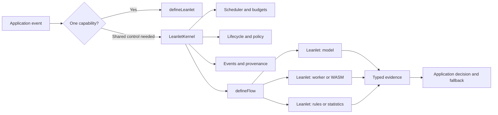

# Leanlet

**Scoped intelligence for browser applications.**

[Website](https://sukumarrekapalli.github.io/leanlet/) ·
[Get started](https://sukumarrekapalli.github.io/leanlet/docs/) ·
[API reference](https://sukumarrekapalli.github.io/leanlet/docs/api/) ·
[SafeShare reference app](https://sukumarrekapalli.github.io/leanlet/studio/) ·
[npm](https://www.npmjs.com/package/leanlet-ai) ·
[Changelog](CHANGELOG.md)

Leanlet is an open-source TypeScript framework for placing small,
task-specific capabilities inside web applications and coordinating them under
one explicit runtime boundary. A capability can use a compact model, Web
Worker, WASM module, local index, statistical method, or deterministic rule.

Applications can begin with one lazy `defineLeanlet()` and no framework-wide
runtime. When the product grows, `LeanletKernel` adds shared scheduling,
lifecycle, policy, budgets, provenance, and observability. `defineFlow()` then
combines typed evidence from several Leanlets into an application-owned
decision.

Leanlet does not turn every interaction into an AI call. Its purpose is to make
narrow local intelligence predictable enough to ship where it provides a
measurable product benefit.

> **Release status:** `0.2.0` is the public stable line. The managed kernel and
> flow APIs are available in `0.3.0-beta.1` under npm tag `next`. The 0.2
> single-capability API remains supported in the beta. See the
> [migration guide](https://sukumarrekapalli.github.io/leanlet/docs/migrate/).

## Contents

- [Why Leanlet](#why-leanlet)
- [Install](#install)
- [Quick setup: one Leanlet](#quick-setup-one-leanlet)
- [Managed setup: kernel and flow](#managed-setup-kernel-and-flow)
- [How the framework fits together](#how-the-framework-fits-together)
- [Framework map](#framework-map)
- [Results and uncertainty](#results-and-uncertainty)
- [Browser vision](#browser-vision)
- [Performance model](#performance-model)
- [Documentation map](#documentation-map)
- [Compatibility and limitations](#compatibility-and-limitations)
- [Release roadmap](#release-roadmap)
- [License and model assets](#license-and-model-assets)

## Why Leanlet

Most web AI integrations send arbitrary context to a general remote model.
That is useful for open-ended work, but it is often unnecessary for bounded
features such as routing, ranking, classification, anomaly signals, matching,
or local preflight checks.

Leanlet provides a different application primitive:

| Requirement                | Leanlet approach                                               |
| -------------------------- | -------------------------------------------------------------- |
| One bounded capability     | Use `defineLeanlet()` for lazy load → run → dispose.           |
| Several local capabilities | Register typed definitions with one `LeanletKernel`.           |
| Resource contention        | Bound concurrency, declared resident bytes, and deadlines.     |
| Repeated identical work    | Coalesce matching in-flight requests without coupling callers. |
| Uncertain output           | Return `accepted`, `abstained`, or `failed` explicitly.        |
| Multi-signal product logic | Compose declared dependencies with `defineFlow()`.             |
| Runtime inspection         | Subscribe to events and read point-in-time snapshots.          |
| Release evidence           | Plan asset bytes/hashes and evaluate classification behavior.  |

Inputs can remain in the browser when every selected capability and asset path
is local. Leanlet itself adds no inference endpoint or telemetry. Application
analytics, remote fallbacks, and custom capability code remain separate trust
boundaries owned by the application.

## Install

Choose the release line deliberately:

```bash
# Stable single-capability and vision APIs
npm install leanlet-ai

# 0.3 beta: adds kernel, flows, asset planning, and evaluation
npm install leanlet-ai@next --save-exact
```

The package is ESM and framework-agnostic. It can be called from React,
Angular, Vue, Svelte, or plain TypeScript. The framework package does not bundle
model weights.

## Quick setup: one Leanlet

Use the minimal API when one capability does not need shared scheduling or
policy:

```ts
import { defineLeanlet } from 'leanlet-ai';

const readingEstimate = defineLeanlet<string, { words: number; minutes: number }>({
  id: 'text.reading-estimate',
  infer(text) {
    const words = text.match(/[\p{L}\p{N}]+/gu)?.length ?? 0;
    return { words, minutes: Math.max(0.1, words / 225) };
  },
});

const estimate = await readingEstimate.run(message);

// Release model, worker, or index state during application teardown.
await readingEstimate.destroy();
```

For capabilities with reusable state, add `load` and `dispose`:

```ts
type SearchResult = { id: string; score: number };
type LocalIndex = {
  search(query: string, options: { limit: number }): SearchResult[];
  close(): void;
};

const search = defineLeanlet<string, SearchResult[], LocalIndex>({
  id: 'docs.search',
  load: () => createApplicationIndex('/docs-index.bin'),
  infer: (query, index) => index.search(query, { limit: 5 }),
  dispose: (index) => index.close(),
});

await search.warmup(); // optional; loading is otherwise lazy
const matches = await search.run('reset password');
await search.destroy();
```

This path has no hidden global kernel, queue, worker, or network behavior.

## Managed setup: kernel and flow

Use `leanlet-ai@next` when several capabilities need a shared control plane.

### 1. Create one kernel for the application resource boundary

```ts
import {
  accepted,
  abstained,
  createLeanletKernel,
  defineFlow,
  type KernelLeanletDefinition,
} from 'leanlet-ai';

const kernel = createLeanletKernel({
  budget: {
    maxConcurrentRuns: 2,
    maxResidentBytes: 96 * 1024 * 1024,
    defaultDeadlineMs: 2_000,
  },
  policy: {
    network: 'static-assets',
    allowedProviders: ['javascript', 'wasm-single'],
  },
});
```

### 2. Register bounded capabilities

```ts
const language: KernelLeanletDefinition<string, DetectedLanguage, LanguageModel> = {
  manifest: {
    id: 'content.language',
    version: '1.0.0',
    task: 'language-routing',
    providers: ['javascript'],
    network: 'static-assets',
    estimatedResidentBytes: 37 * 1024 * 1024,
  },
  load: () => createLanguageModel(),
  async run(text, model) {
    const result = await model.detect(text);
    return result.reliable
      ? accepted({ code: result.code, score: result.score })
      : abstained('low-score', result.candidates);
  },
  dispose: (model) => model.destroy(),
};

kernel.register(language);
kernel.register(secretDetector); // application-defined capability
kernel.register(releasePolicy); // application-defined capability
```

### 3. Compose typed evidence

```ts
const preflight = defineFlow<string, ReleaseDecision>({
  id: 'content.preflight',
  version: '1.0.0',
  uses: ['content.language', 'content.secrets', 'policy.release'],
  async run(text, context) {
    const [language, secrets] = await Promise.all([
      context.run('content.language', text),
      context.run('content.secrets', text),
    ]);

    return context.run('policy.release', { language, secrets });
  },
});

const navigationSignal = new AbortController().signal;
const { result, trace } = await preflight.run(kernel, draft, {
  deadlineMs: 1_000,
  signal: navigationSignal,
});

await kernel.destroy();
```

The flow may call only IDs declared by `uses`. Its trace records completion
order, status, and timing. The application still owns thresholds, fallback,
consent, persistence, and the final product behavior.

## How the framework fits together



- A **Leanlet** owns one typed capability and its reusable state.
- The **kernel** owns registration, admission, scheduling, shared lifecycle,
  and in-memory observability.
- A **flow** owns explicit orchestration and allowed dependencies.
- The **application** owns product policy and user-visible consequences.

## Framework map

| Surface            | Purpose                                           | Primary exports                                                   |
| ------------------ | ------------------------------------------------- | ----------------------------------------------------------------- |
| Minimal lifecycle  | Run one lazy capability without a kernel          | `defineLeanlet`, `LeanletDefinition`, `ScopedLeanlet`             |
| Managed runtime    | Register and schedule multiple capabilities       | `createLeanletKernel`, `LeanletKernel`, `KernelLeanletDefinition` |
| Structured results | Separate output, abstention, and failure          | `accepted`, `abstained`, `LeanletResult`, `LeanletError`          |
| Composition        | Coordinate declared dependencies                  | `defineFlow`, `LeanletFlow`, `LeanletFlowTrace`                   |
| Resource controls  | Bound concurrency, deadlines, and declared memory | `LeanletKernelBudget`, `KernelRunOptions`                         |
| Admission policy   | Select allowed provider/network classes           | `LeanletKernelPolicy`, `LeanletManifest`                          |
| Observability      | Runtime events, timing, provenance, and snapshots | `LeanletKernelEvent`, `LeanletKernelSnapshot`                     |
| Asset planning     | Deduplicate and validate release asset metadata   | `planLeanletAssets`, `LeanletAssetPlan`                           |
| Evaluation         | Measure classification coverage and quality       | `evaluateClassification`, `ClassificationEvaluationMetrics`       |
| Browser vision     | Run supported product-image profiles in a worker  | `VisionLeanlet`, `LEANLET_MODELS`, `LeanletModelId`               |

See the [complete API reference](https://sukumarrekapalli.github.io/leanlet/docs/api/)
for every exported value, type, option, default, result field, event, and error.

## Results and uncertainty

Managed runs resolve a discriminated union:

```ts
if (result.status === 'accepted') {
  use(result.output, result.score, result.timing, result.provenance);
} else if (result.status === 'abstained') {
  fallback(result.reason, result.candidates);
} else {
  report(result.error.code, result.recoverable);
}
```

An accepted `score` is capability-defined evidence, not automatically a
probability. Use `calibratedConfidence` only when a documented calibration
procedure supports that meaning. Running deadlines and cancellation are
cooperative; a native WASM or GPU operation can finish before observing an
aborted signal.

## Browser vision

Install only the model profile the application has evaluated:

```bash
npx leanlet models list
npx leanlet models add mobilenet-v4-small --dir public/leanlet-assets
```

```ts
import { VisionLeanlet } from 'leanlet-ai';

const vision = new VisionLeanlet({
  model: 'mobileclip-s0-compact',
  categories: ['Electronics', 'Clothing', 'Home', 'Other'],
  assetBase: '/leanlet-assets/',
  threads: 1,
});

const result = await vision.classify(file, { signal });
console.log(result.category, result.score, result.elapsedMs);
vision.destroy();
```

| Profile                 | Approximate model download | Category behavior                                         |
| ----------------------- | -------------------------: | --------------------------------------------------------- |
| `mobilenet-v4-small`    |                     3.9 MB | Fixed ImageNet vocabulary; smallest known-object baseline |
| `mobilenet-v4-medium`   |                      10 MB | Larger fixed-vocabulary baseline                          |
| `mobileclip-s0-compact` |                      55 MB | Quantized, application-defined category text              |
| `mobileclip-s0-fp16`    |                      66 MB | FP16 vision, application-defined category text            |
| `mobileclip-s0`         |                      89 MB | Full-precision vision, application-defined category text  |

Model sizes exclude the shared ONNX Runtime payload. Fixed-vocabulary
MobileNet profiles are not general arbitrary-taxonomy classifiers. Evaluate
quality, cold bytes, latency, and responsiveness on every supported device
class.

## Performance model

Leanlet's main runtime optimization is in-flight request coalescing:

```ts
const result = await kernel.run('image.embedding', image, {
  coalesceKey: contentHash,
  signal,
});
```

Concurrent requests with the same Leanlet ID and exact application key share
one queued or active computation. Each caller can cancel its own wait without
cancelling work required by others. Results are not retained after settlement.

The kernel also provides lazy loading, runtime reuse, bounded concurrency,
priority and earliest-deadline ordering, and least-recently-used idle eviction
under declared-memory pressure. See the [performance notes](docs/PERFORMANCE.md) and
the included `npm run benchmark:kernel` synthetic scheduler benchmark.

## Documentation map

| Start here                                                                      | What it contains                                                                                                |
| ------------------------------------------------------------------------------- | --------------------------------------------------------------------------------------------------------------- |
| [Learning guide](https://sukumarrekapalli.github.io/leanlet/docs/)              | Concepts, API selection, first Leanlet, kernel, flows, vision, evaluation, deployment, and production checklist |
| [Complete API reference](https://sukumarrekapalli.github.io/leanlet/docs/api/)  | Every public export, signature, option, default, method, result, event, and error                               |
| [0.2 → 0.3 migration](https://sukumarrekapalli.github.io/leanlet/docs/migrate/) | Compatibility matrix, upgrade steps, event/score changes, rollout, and rollback                                 |
| [SafeShare](https://sukumarrekapalli.github.io/leanlet/studio/)                 | Working eight-Leanlet browser application with actual traces and decisions                                      |
| [Live capability cases](https://sukumarrekapalli.github.io/leanlet/#cases)      | Vision, routing, ranking, anomaly, retrieval, language, forecasting, and matching examples                      |
| [Architecture](docs/ARCHITECTURE.md)                                            | Layer ownership, execution sequence, lifecycle, scheduling, and security boundaries                             |
| [Adapter authoring](docs/ADAPTERS.md)                                           | Requirements for wrapping a model, worker, WASM runtime, index, or algorithm                                    |
| [Language adapter](docs/LANGUAGE_MODELS.md)                                     | Worker lifecycle, selectable ELD profiles, reliability semantics, coverage, and production validation          |
| [Performance](docs/PERFORMANCE.md)                                              | Measurement model, coalescing, budgets, and benchmark interpretation                                            |
| [Release notes](docs/releases/0.3.0-beta.1.md)                                  | Beta changes, reliability work, and known constraints                                                           |
| [Next release](docs/NEXT_RELEASE.md)                                            | Current beta.2 engineering priorities and stable promotion gates                                                |
| [Security policy](SECURITY.md)                                                  | Vulnerability reporting and framework security boundaries                                                       |
| [Contributing](CONTRIBUTING.md)                                                 | Repository setup, checks, and contribution expectations                                                         |

## Compatibility and limitations

- The core package requires ESM. The vision adapter requires modern browser
  support for module workers, WebAssembly, AbortController, and related APIs.
- Model/configuration/WASM assets must be served from the configured
  `assetBase`; model weights are not included in npm.
- The network/provider policy checks declarations. It is not a JavaScript
  sandbox; use CSP, origin boundaries, dependency review, and browser
  permissions for hard controls.
- Declared resident bytes guide admission and eviction. They are not exact
  browser heap or accelerator-memory measurements.
- Flows are in-page orchestration, not durable jobs, distributed consensus, or
  cross-tab scheduling.
- Leanlet does not make a model accurate, fair, calibrated, or appropriate for
  a product decision. Release gates require representative evaluation data.

See [browser and deployment requirements](https://sukumarrekapalli.github.io/leanlet/docs/#browser-support)
and the [full limitations](https://sukumarrekapalli.github.io/leanlet/docs/#limitations).

## Release roadmap

The next planned prerelease is `0.3.0-beta.2`, centered on:

1. separating a dependency-light core from the vision adapter while preserving
   the current root import through a compatibility window;
2. an adapter conformance suite and manifest JSON Schema;
3. reusable worker-RPC and small ONNX adapter primitives;
4. Chromium, Firefox, and WebKit integration evidence, including constrained
   mobile profiles;
5. reproducible cold/warm/responsiveness performance fixtures;
6. React, Angular, Vue, and framework-free integration examples.

The detailed working plan and stable promotion gates are tracked in
[docs/NEXT_RELEASE.md](docs/NEXT_RELEASE.md). Roadmap entries are direction, not
a compatibility or delivery promise.

## License and model assets

Leanlet framework code is licensed under Apache-2.0. Model weights and related
assets retain their upstream licenses and notices and are not part of the npm
package. Review [MODEL_LICENSES.md](MODEL_LICENSES.md) before distributing a
model profile.
